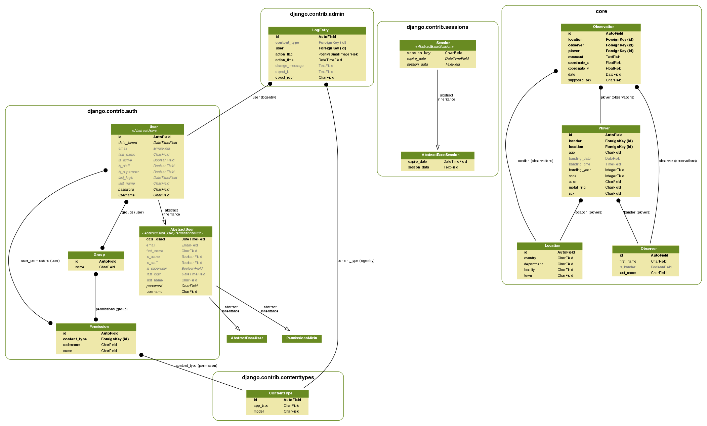

# banding-tracking-v2
Version 2.0 for the banding-tracking website

The project was written with `Python 3`. If `Python 3` is your default version, just start all the commands with `python`

## What do you need for this project ?

### Dependencies

#### Install the python dependencies

You can install all the python dependencies for this project with the command `pip install -r requirements.txt`.

Some packages are in the requirements.txt but are optional :
 * [django-extensions](https://github.com/django-extensions/django-extensions): collection of custom extensions for the Django Framework.
 * [Pyrollbar (Rollbar for python)](https://github.com/rollbar/pyrollbar) : notifier for reporting exceptions, errors, and log messages to Rollbar.


#### Other dependencies
 * [gettext](https://www.gnu.org/software/gettext/)
   * For Linux users, the package is usually installed by default
   * For Windows, [see here](https://docs.djangoproject.com/en/1.9/topics/i18n/translation/#gettext-on-windows])
 * [bower](https://bower.io/)

### Configure the project
 * install all the python dependencies for this project with the command `pip install -r requirements.txt`.
 * Install the bower dependencies with `bower install`
 * Rename the `local_settings.template` in `local_settings.py` (into the banding_traking folder)
 * Inside this file, generate a brand new `SECRET_KEY`
 * Configure the `DATABASES` variable
 * Compile all the translation dictionaries : `python3 manage.py compilemessages`
 * Migrate the database : `python3 manage.py migrate`
 * Load fixtures : `python3 manage.py loaddata fixtures/*`

#### Optionnal :
 * Initiate the Rollbar intergration :
   * Go to https://rollbar.com and get an access token for this project
   * Set it in `ROLLBAR_ACCESS_TOKEN`

## How to lauch the project ?
 * Launch the project with `python3 manage.py runserver`
 * Go to http://127.0.0.1:8000 and enjoy !

## Other usefull commands
 * Generate the translation file for a specific language : ```django-admin.py makemessages -l <LANGUAGE CODE>```
 * Generate all the translation files ```django-admin.py makemessages -all```
 * Generate a schema of the database : `python manage.py graph_models`
 * Flush database : `python manage.py flush`
 * Seed database : `python manage.py loaddata locations.json observers.json plovers.json

## Database graph


